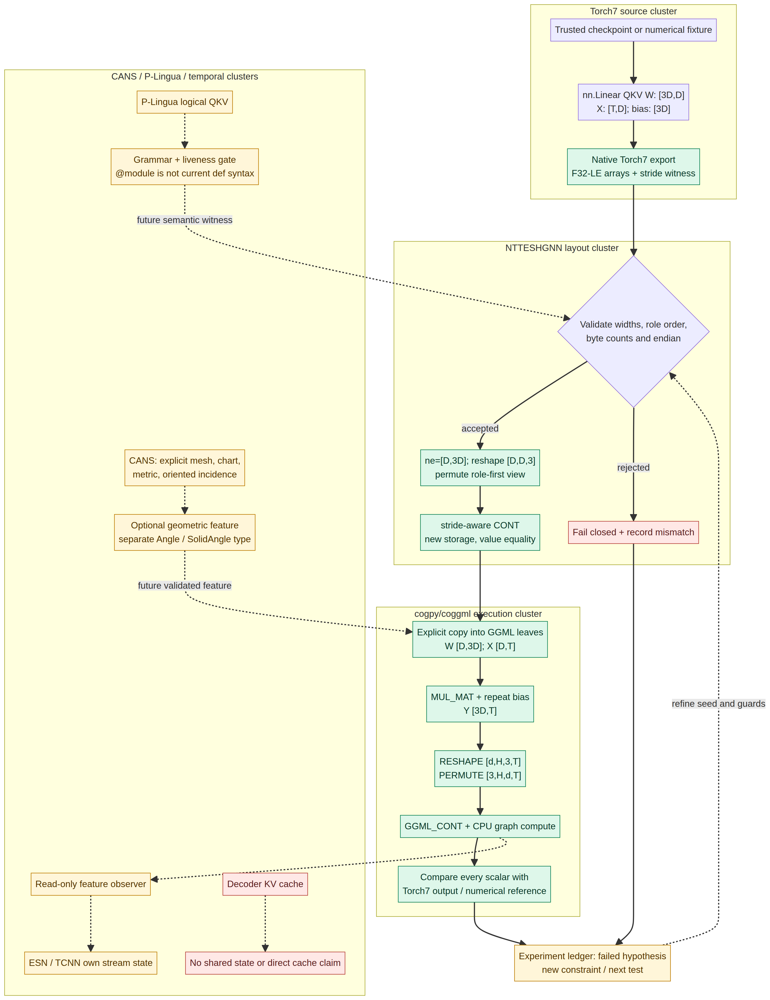
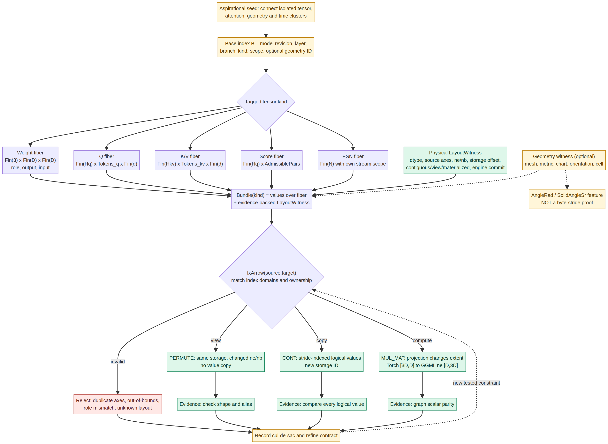

# From an aspirational integration seed to a falsifiable map

**Seed.** Can Torch7's QKV projections, NTTESHGNN's typed tensor substrate, GGML's graph, P-Lingua's attention grammar, CANS/GQS geometry, and autonomous temporal state form a federated architecture? The answer is not obtained by renaming components as though they already interoperate. Treat their possible composition as an **aspirational conjecture**: make an intuitive best guess, build the narrowest observable bridge, test its mismatch, revise it, and carry both successes and cul-de-sacs forward. “Diffusion” here describes an exploratory **method**, not a trained diffusion model or evidence of integration by analogy alone.





The editable Mermaid sources are [`integration-architecture.mmd`](integration-architecture.mmd) and [`fiber-contracts.mmd`](fiber-contracts.mmd).

## Experimental ledger

| Stage | Conjecture / intervention | Measured result | Next constraint or decision |
|---|---|---|---|
| Seed | A transposed tensor might be made contiguous by copying `numel × sizeof(dtype)` bytes from its `data` pointer. | On the pre-patch `2×3` tensor, transpose→contiguous disagreed on **4/6** logical values despite the repository's **4/4** existing CTest targets passing. | **Falsified.** Raw span is not logical order for noncontiguous views. |
| Denoise 1 | Enumerate destination coordinates with dim 0 fastest and compute `source_byte_offset = Σ index[i]·nb[i]`; verify the highest accessed byte fits the storage. | Original reproducer reports **0/6 mismatches** after the fix; new tests check an offset slice and independent storage, as well as rejection of invalid external spans. | Contiguity is a tested value/materialization transition, not merely a shape flag. Quantized, sub-byte and non-CPU copy remain unsupported. |
| Denoise 2 | Treat `nt_tensor_permute` as a metadata-only view with `dims[out_axis]=in_axis`, then materialize explicitly. | Rank-4 permutation and inverse retain storage for views and recover every value after copy; duplicate/out-of-range axes are rejected. | Do **not** pass those integers unchanged to GGML: the pinned GGML mapping is `axis[in_axis]=out_axis`. |
| Denoise 3 | Torch7's `[3D,D]` contiguous row bytes can be interpreted as GGML `ne=[D,3D]` **after** explicit F32/endian/role/size validation. | A real GGML CPU graph computed three independent small numerical fixtures and matched every output scalar after fused-row→role/head/channel reshape, permute and CONT; four malformed witness/data variants were rejected. **Six of six** opt-in CTest targets passed. | This validates the specified projection boundary, **not** a trained transformer, an unobserved Torch7 run, a GGUF loader or a decoder cache. |
| Next trial | Export an actual trusted Torch7 module/checkpoint with an original non-contiguous or nonzero-offset weight and compare its `nn.Linear` output to the same GGML graph. | **Not run here:** native Torch7/THNN and `th` are absent. The exporter passed Lua 5.1 syntax checking only. | Acquire native Torch7 environment and run a full parity trace; only then claim cross-runtime numerical equivalence. |

For the minimal counterexample, contiguous source `ne=[2,3]`, `nb=[4,8]` bytes stores `[1,2,3,4,5,6]`. The transposed **view** is `ne=[3,2]`, `nb=[8,4]` bytes, so its logical dim-0-fastest sequence is `[1,3,5,2,4,6]`. Raw `memcpy` yields the former and disagrees in four positions. The corrected copy uses each logical index tuple to read `data + Σ index[i]·nb[i]`; its destination owns contiguous storage. The unit test checks every value and the view's alias identity separately.

The earlier `4/6` result was a **counterexample** to a tempting integration leap. The correction is scientific rather than cosmetic: make the hypothesis explicit, obtain a small contrary observation, change the materialization law, then test values, aliasing, rank, offsets and reject paths. No hardcoded agent responses or invented convergence metrics are used; the numerical fixtures are plainly labeled test inputs.

## Federated fibers are contracts, not a nine-axis allocation

For base `b=(engine_revision,layer,branch,tensor_kind,state_scope,geometry_id?)`, define a tagged family `Fiber(b)`:

```text
Weight   -> Fin(role=3) × Fin(output=D) × Fin(input=D)  [logical roles]
Q        -> Fin(Hq) × QueryToken × Fin(d)
K / V    -> Fin(Hkv) × KeyToken   × Fin(d)
Score    -> Fin(Hq) × AdmissiblePair(query,key)
ESN      -> Fin(reservoir_size) with its own stream scope
Bundle(b)= (values: Fiber(b) -> scalar, LayoutWitness(b))
IxArrow(i,j)= (run: Bundle(i) -> Result<Bundle(j)>, check: compatible(i,j))
```

`LayoutWitness` carries physical facts (dtype, logical axis roles, `ne`, **byte** `nb`, storage/offset/alias, version and materialization status). `geometry_id` points to a distinct, optional CANS mesh/chart/metric/orientation; an angle in radians and a solid angle in steradians are different result types and **neither is a stride**. ESN/TCNN state and decoder KV cache likewise have disjoint ownership. The prototype's C ABI plus runtime validation is a *partial executable witness*, not a language-level dependent proof.

The example NTTESHGNN **physical** role-first view uses `ne=[role,input,output]` and computes the logical lookup `W(role,output,input)` by a witnessed reindexing. The logical index product above is intentionally not a promise about in-memory axis order; that distinction is the point of the boundary adapter.

## Dead-end map: distinguish impossibility from unfinished work

| Proposed shortcut | Current status | What could change it? |
|---|---|---|
| Infer tensor byte strides from CANS angles or curvature. | **Category error**: geometry does not determine storage layout. | No revised solver can turn geometry into a storage proof; a **separate layout witness** is required. Geometry may produce features if tokens have real incidence/metric. |
| Obtain decoder KV cache identity from the supplied `/completion` text adapter. | **Impossible under the observed interface**: it exposes neither cache handle nor sequence ownership. | Add a server API with explicit model/session/sequence/reset/fork semantics and verify a decoder trace. |
| Compile pasted `@module`/`@rules` directly with the examined owned 9cog/plingua parser. | **Incompatible current dialect**, not a fundamental impossibility. | Implement/test a semantics-preserving frontend or extend the pinned grammar; then repair missing attention routes and completion barriers. |
| Treat existing NTTESHGNN's green test suite as proof of stride-safe copy. | **Falsified** by 4/6 counterexample. | Covered here for scalar CPU with a value-level regression; block-quantized and device kernels still need distinct implementations. |
| Borrow SAM ViT-B's 768/12/14 configuration or fused QKV order for every GGML model. | **Unjustified generalization.** | Read each target model's own converter/loader and instrument its actual `ne[]`, `nb[]`, head topology and graph. |
| Claim a Torch7 checkpoint-to-GGML bridge is proven by a Python fixture. | **Evidence gap**, not a mathematical barrier. | Run `th export_torch7_qkv.lua` with trusted native Torch7 and compare its emitted reference scalars in the same GGML graph. |

## Success criterion for a new cluster

A proposed connector moves from **seed** → **hypothesis** → **tested witness** → **supported adapter** only if (1) its inputs and version are pinned, (2) the invariants and prohibited shortcuts are written down, (3) at least one realistic negative test fails for the right reason, (4) output values and alias/state provenance survive the boundary, and (5) the result can be reproduced independently. A cul-de-sac is useful data: keep its smallest counterexample and the precise interface change that would make a later trial possible.
